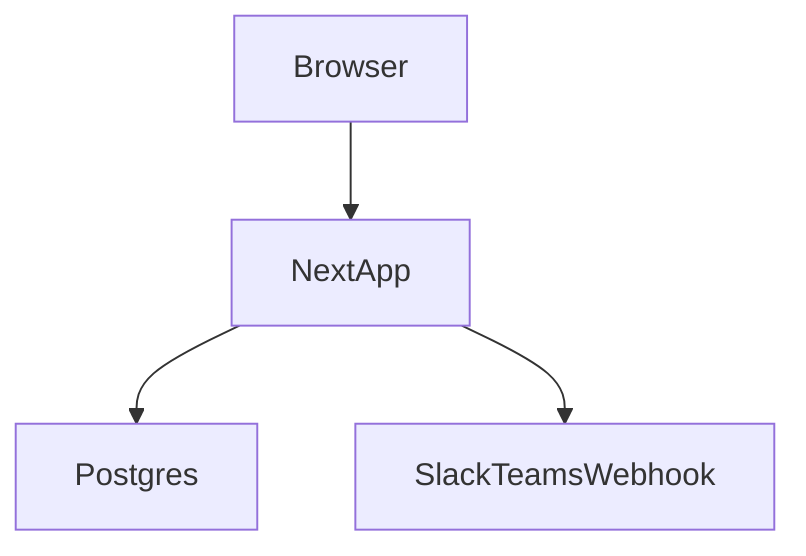

# Internal Q&A Platform – MVP Feature Definition

**Document Type:** Product & Architecture Specification  
**Audience:** Engineering, Platform, DevOps, Knowledge Management  
**Objective:** Build a simple, high-value internal “Stack Overflow” for the organization

---

## 1. Purpose & Scope

This document defines the **Minimum Viable Product (MVP)** feature set for an **internal, self-hosted Q&A platform** intended to:

- Capture organizational knowledge
- Reduce repeated questions and tribal knowledge loss
- Support developer onboarding and faster issue resolution
- Integrate naturally with the SDLC

The MVP explicitly prioritizes **simplicity, usability, and adoption** over feature completeness.

The design is **platform-agnostic**, but compatible with solutions such as **Discourse (Q&A mode)** or **Apache Answer**.

---

## 2. MVP Design Principles

1. **Q&A First**  
   The system exists to answer questions, not host discussions.

2. **Search Over Navigation**  
   Users should find answers faster via search than browsing.

3. **Flat Structure**  
   Avoid deep hierarchies and complex taxonomies in MVP.

4. **SDLC Integration**  
   Knowledge must connect to real engineering work.

5. **Low Governance Overhead**  
   The platform should not require heavy moderation to function.

---

## 3. Core Q&A Capabilities (Mandatory)

| Feature | Included | Description |
|------|----------|------------|
| Ask Question | Yes | Any authenticated user can ask |
| Answer Question | Yes | Multiple answers allowed |
| Accepted Answer | Yes | One canonical answer per question |
| Edit Answers | Yes | Knowledge can evolve |
| Answer Voting | Optional (Light) | Ranking without gamification |
| Comments | Limited | Clarification only |

**Design Rule:**  
Every question must converge toward **one accepted answer**.

---

## 4. Tagging Model (Simplified & Controlled)

Tagging is the **primary organizational mechanism** in the MVP.

### 4.1 Tag Dimensions (Maximum Three)

| Tag Dimension | Examples | Purpose |
|--------------|----------|---------|
| Technology | `react`, `postgres`, `docker` | Technical discovery |
| Domain | `payments`, `auth`, `analytics` | Business context |
| SDLC Stage | `development`, `testing`, `deployment`, `incident` | Lifecycle mapping |

### 4.2 Tag Governance

- Tags are **predefined and curated**
- Free-form user-created tags are **not allowed in MVP**
- Flat structure only (no parent-child hierarchies)

**Design Rule:**  
Tags must improve search relevance, not taxonomy complexity.

---

## 5. Search & Discovery (Highest ROI Area)

| Capability | MVP Requirement | Notes |
|----------|----------------|------|
| Full-Text Search | Mandatory | Index titles and answers |
| Tag-Based Search | Mandatory | Combined with text search |
| Relevance Ranking | Mandatory | Accepted answers ranked first |
| Filters | Minimal | Tag + date |
| Advanced Search (Elastic) | Optional | Add if scale demands |

**Success Metric:**  
A user should find a relevant answer within **10 seconds**.

---

## 6. Knowledge Authoring & Workflow

| Feature | Included | Rationale |
|------|----------|-----------|
| Markdown Support | Yes | Developer-native |
| Code Highlighting | Yes | Essential |
| Image Uploads | Limited | Diagrams only |
| Edit History | Basic | Accountability |
| Content Ownership | No | Avoid silos |

**Design Rule:**  
Knowledge is **collectively owned**, not person-owned.

---

## 7. SDLC Touchpoints (Critical for Adoption)

### 7.1 Required Integrations (MVP)

| Tool | Integration Level |
|----|------------------|
| GitHub / GitLab | Manual PR and issue links |
| Jira | Auto-link ticket IDs |
| Slack / MS Teams | Notifications for new questions |
| CI/CD | Manual linking only |

### 7.2 Example Workflow

---

## 8. Custom MVP Plan (Next.js + Postgres)

### 8.1 Goals (from `day1.md`)

- **Q&A-first**: ask, answer, accept 1 canonical answer, edit answers.
- **Search-first**: full-text + tag-based search; accepted answers ranked first.
- **Flat + controlled tags**: curated, predefined tags only; max 3 dimensions.
- **Low governance overhead**: minimal moderation; collective ownership.
- **SDLC touchpoints**: Jira auto-link; Slack/Teams notifications; manual GitHub/GitLab links.

### 8.2 Proposed architecture

- **Web/App**: Next.js (App Router) fullstack (server actions / route handlers) for UI + APIs.
- **DB**: Postgres.
- **ORM**: Prisma.
- **Search**: Postgres full-text search (tsvector + GIN) over question title/body and answers; ranking boosts accepted answer.
- **Auth**: Local accounts (email + password hash), cookie-based session.
- **Deployment**: Docker Compose for MVP (web + postgres).

### 8.3 Data model (MVP)

- **User**: `id`, `email` (unique), `passwordHash`, `displayName`, `role` (USER|ADMIN), `createdAt`.
- **Question**: `id`, `title`, `bodyMarkdown`, `bodyHtml` (optional), `authorId`, `status` (OPEN|CLOSED optional), `acceptedAnswerId` (nullable), `createdAt`, `updatedAt`.
- **Answer**: `id`, `questionId`, `bodyMarkdown`, `authorId`, `isAccepted` (derived or stored), `createdAt`, `updatedAt`.
- **Comment** (limited): `id`, `parentType` (QUESTION|ANSWER), `parentId`, `body`, `authorId`, `createdAt`.
- **TagCategory** (3 max): `TECHNOLOGY`, `DOMAIN`, `SDLC_STAGE`.
- **Tag** (curated): `id`, `name` (unique), `category`, `description`.
- **QuestionTag**: join table (`questionId`, `tagId`), enforce max 3 tags (optionally 1 per category).
- **EditHistory** (basic): `id`, `entityType` (QUESTION|ANSWER), `entityId`, `editorId`, `diffOrSnapshot`, `createdAt`.
- **Vote** (optional “light”): `id`, `answerId`, `voterId`, `value` (+1 only), unique `(answerId, voterId)`.

### 8.4 Core user flows + UI routes

- **Auth**: `/login`, `/register`, `/logout`.
- **Ask**: `/ask` (title, body, select curated tags).
- **Browse**: `/questions` (search bar + tag filters + date filter; defaults to relevance).
- **Detail**: `/questions/[id]` (question, answers sorted with accepted first; accept/unaccept for asker/admin).
- **Edit**: edit question/answer (records `EditHistory`).
- **Tags**: `/tags` (search tags; browse by category).
- **Admin**: `/admin/tags` (CRUD curated tags; optionally import seed list).

### 8.5 Search & ranking (meet 10s metric)

- **Indexing**:
  - Maintain `tsvector` for `Question(title, bodyMarkdown)` and for `Answer(bodyMarkdown)`.
  - Use GIN indexes.
- **Query**:
  - Search text across question + answers.
  - Combine with selected tags.
  - Rank results: boost questions with accepted answers and/or matching accepted answer text.

### 8.6 SDLC touchpoints (MVP)

- **Jira auto-link**: in markdown rendering, detect `ABC-123` patterns and link to configured Jira base URL.
- **Slack/Teams notifications**: webhook call on “new question created” (config via env vars, toggleable).
- **GitHub/GitLab manual links**: allow users to paste links in markdown; no special integration needed.

### 8.7 Non-goals (explicitly deferred)

- SSO/OIDC, complex moderation, reputation/gamification, nested categories, user-created tags, Elastic/OpenSearch.

### 8.8 Implementation steps (high level)

- Create Next.js app, baseline UI shell, and env/config.
- Add Postgres + Prisma schema + migrations + seed curated tags.
- Implement auth + sessions + protected routes.
- Implement Q&A CRUD (question/answer/comment) + accept answer.
- Implement edit flow + edit history.
- Implement search + tag filters + relevance sorting.
- Add admin tag management + governance enforcement.
- Add Jira auto-link + Slack/Teams webhook notifications.
- Add docker-compose + production build/run instructions.

### 8.9 Execution checklist (todos)

- **repo-setup**: Initialize Next.js fullstack app; add TypeScript, lint/format baseline; add Docker Compose for Postgres + local dev env template.
- **db-schema**: Add Prisma schema for User/Question/Answer/Tag/QuestionTag/Comment/EditHistory (+ optional Vote), migrations, and a seed for curated tags + admin user.
- **auth-sessions**: Implement local auth (register/login/logout), password hashing, session cookies, and role-based guard for admin routes.
- **qa-core**: Implement ask/read/update flows for questions and answers; accept/unaccept answer with permissions; limited comments for clarifications.
- **edit-history**: Add basic edit history capture on question/answer edits and show a minimal history view.
- **search-tags**: Implement Postgres full-text search + tag/date filters; relevance ranking with accepted-answer boost; ensure tag governance (curated only, max 3).
- **admin-tags**: Add admin UI for curated tag CRUD and guard it by role; enforce category constraints.
- **sdlc-integrations**: Add Jira ticket auto-linking in rendered markdown and Slack/Teams webhook notification on new question creation (configurable).
